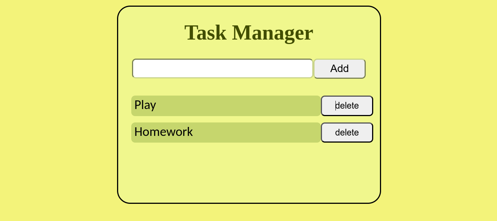

# ToDo App

A very simple application that helps you add and remove tasks.  
This application uses **React** to render the UI elements.



---

### 🚀 How to run this app

1. **Navigate to the folder where you want to clone the project**  
   ```bash
   cd /path/to/your/folder
   ```

2. **Clone the repository**  
   ```bash
   git clone https://github.com/AyyoubElKouri/toDoApp.git
   ```

3. **Go into the cloned project folder**  
   ```bash
   cd toDoApp
   ```

4. **Install dependencies**  
   With npm:  
   ```bash
   npm install
   ```
   Or with yarn:  
   ```bash
   yarn install
   ```

5. **Start the project**  
   With npm:  
   ```bash
   npm run dev
   ```
   Or with yarn:  
   ```bash
   yarn run dev
   ```

6. **Open your browser and visit**  
   ```
   http://localhost:5173/
   ```
